# Network Protocol Security Lab Walkthrough

## 1. Lab Setup
### Objective
The goal of this lab is to explore vulnerabilities in common network protocols (FTP, TELNET, SSH, HTTP) by performing brute force attacks, sniffing network traffic, and analyzing security weaknesses. Additionally, mitigation strategies will be proposed to improve security.

### Environment
- **Kali Linux** (Attacker Machine)
- **Metasploitable 2** (Target VM)
- **Tools Used:**
  - Hydra, Medusa, NetExec (Brute Force Attacks)
  - Burp Suite (HTTP Login Brute Force)
  - Wireshark, tcpdump (Traffic Sniffing)
  - Nmap, Enum4Linux (Enumeration)

## 🔍 2. Enumeration
### 🎯 Scanning the Target Machine
First, identify open ports and services running on the target VM:
```bash
nmap -sC -sV -p 21,22,23,80 <TARGET_IP>
```

**Explanation:**
- `-sC`: Runs default NSE scripts
- `-sV`: Service version detection
- `-p`: Scans only specified ports (FTP, SSH, Telnet, HTTP)

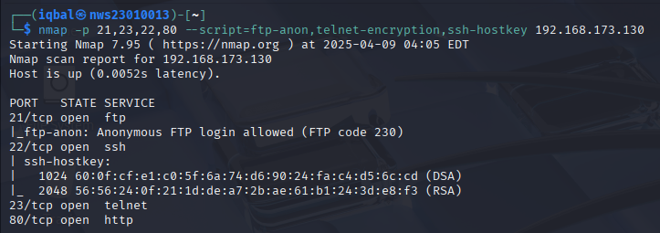

**Alternative (with specific scripts):**
```bash
nmap -p 21,22,23,80 --script=ftp-anon,telnet-encryption,ssh-hostkey,http-title <TARGET_IP>
```

🔧 **Expected Output:**  
A list of open ports, service banners, and basic vulnerability info (e.g., anonymous FTP access, SSH keys, Telnet security, web titles)

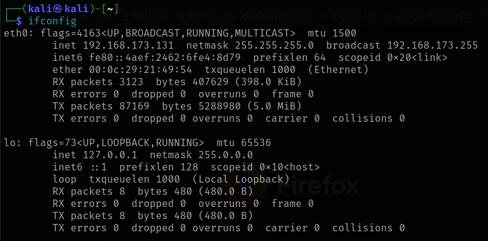

### Enumerating Usernames
#### 🧱 From SMB (to use with SSH, Telnet, FTP later):
```bash
enum4linux -a <TARGET_IP>
```
**What it does:**  
Enumerates users, shares, groups, and policies over SMB. Useful for finding valid system usernames that might also exist in SSH/Telnet/FTP.

> 💡 Look for usernames like `msfadmin`, `user`, `postgres`, etc. in the output.

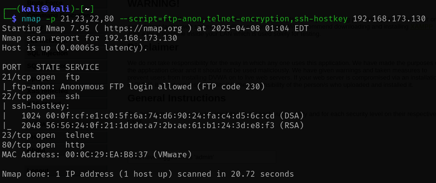
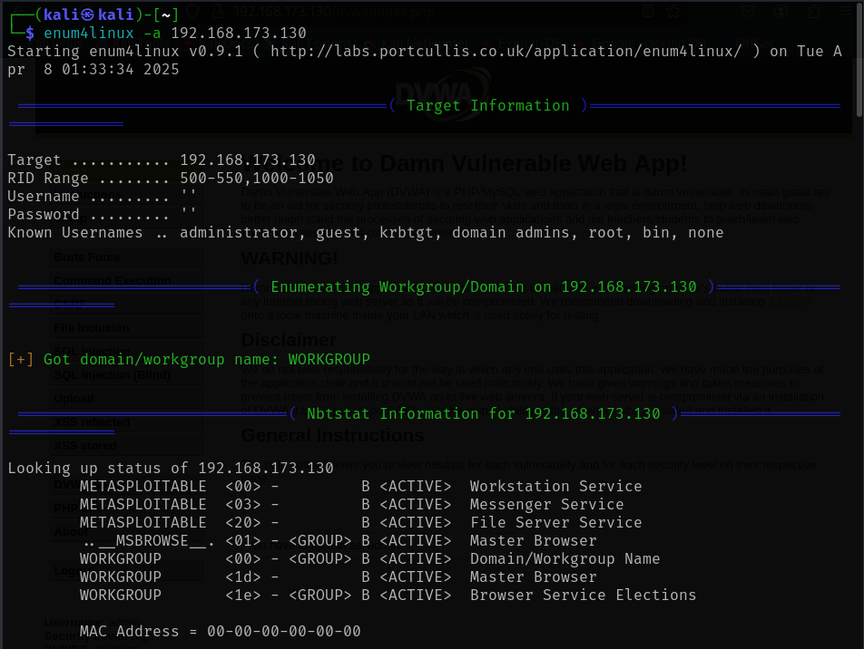
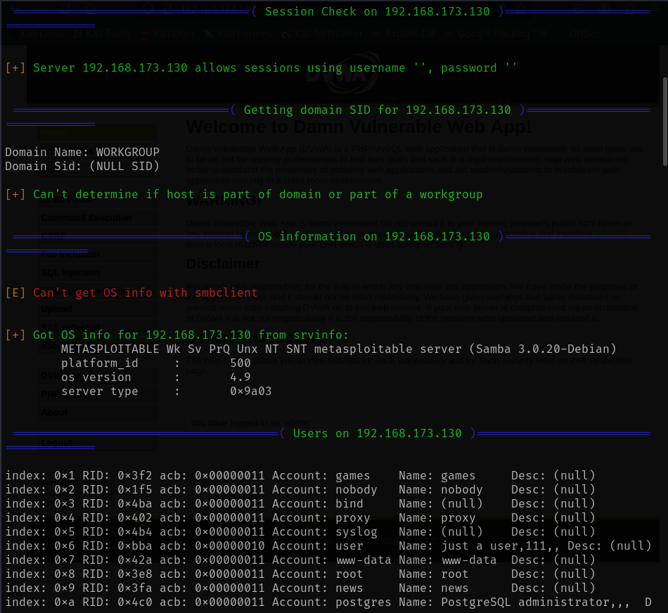
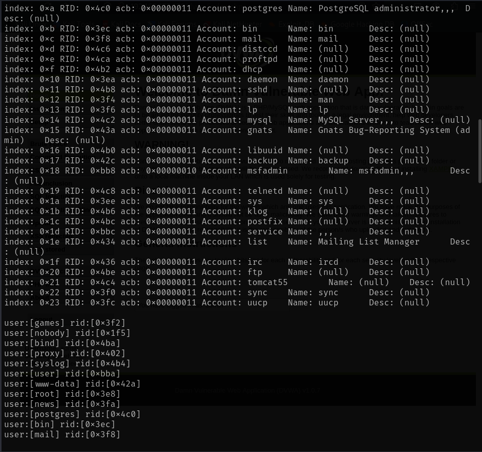
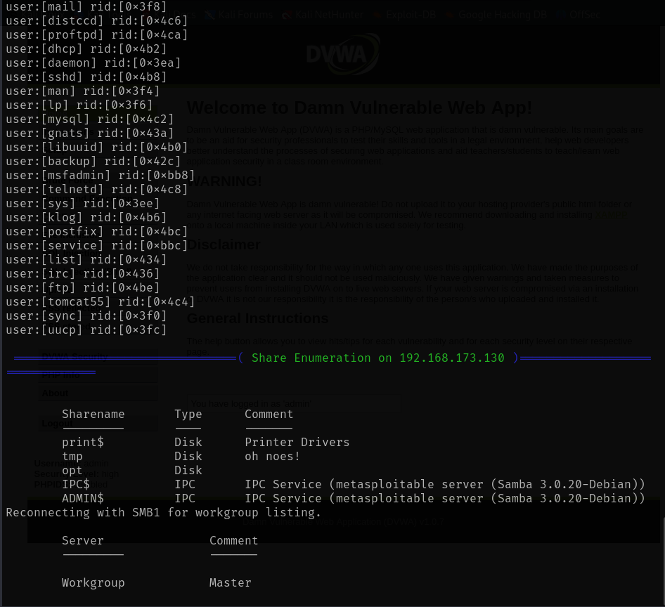
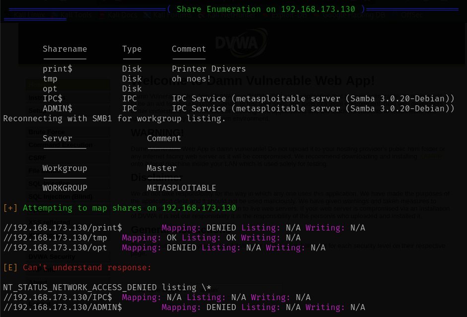

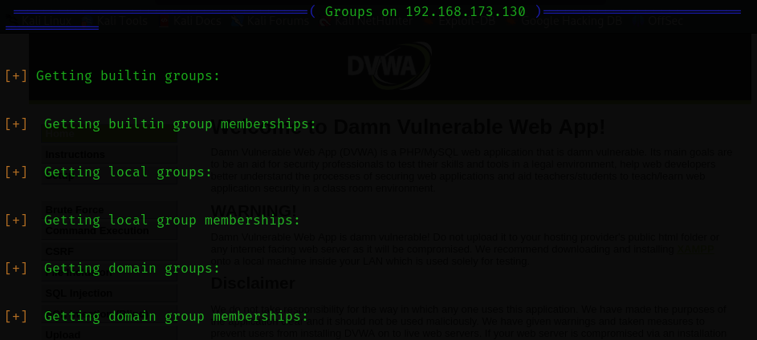
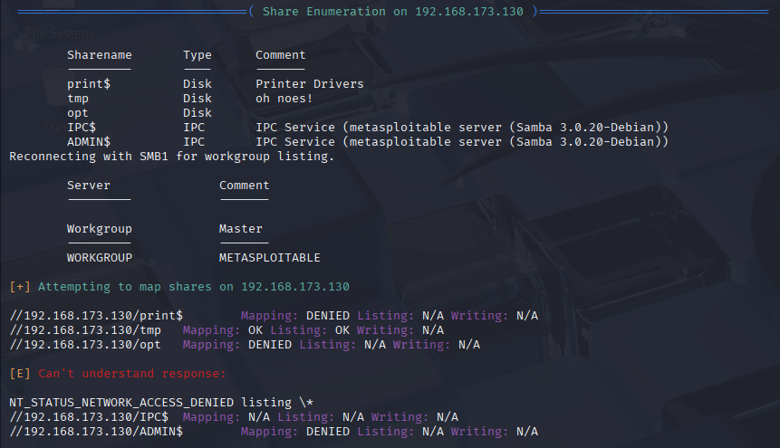
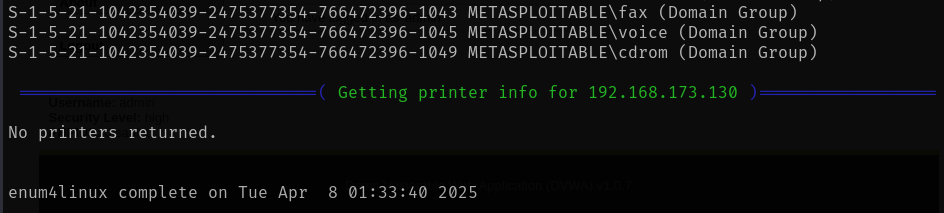
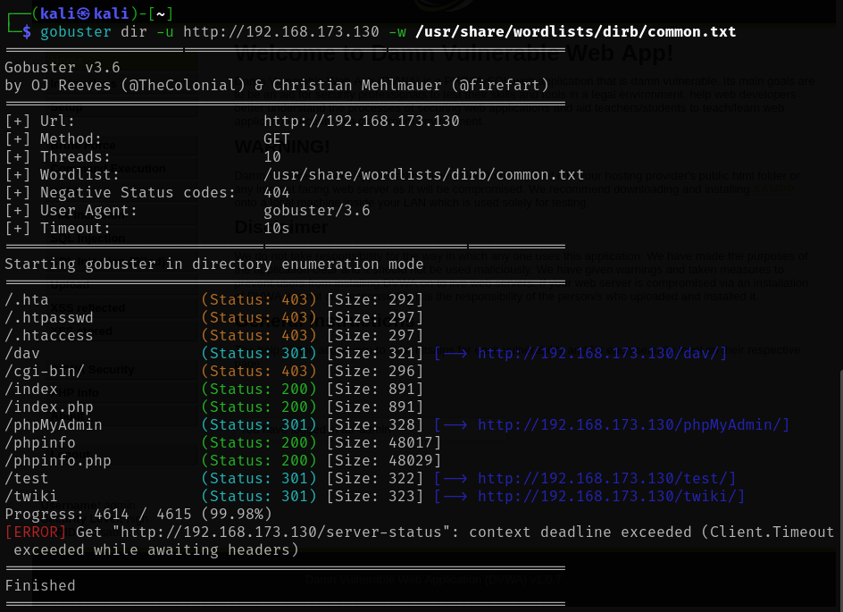
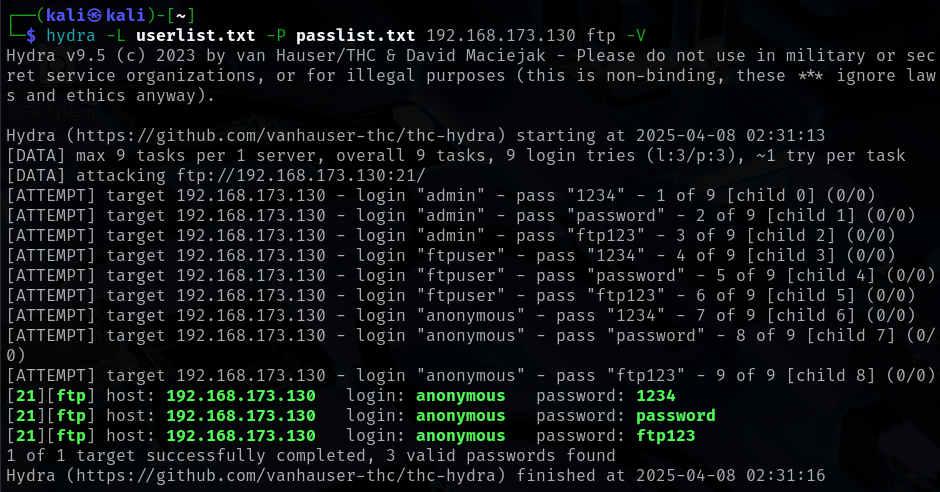
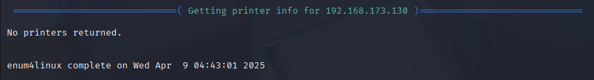

#### 🌐 Web Server Enumeration (HTTP)

Use `gobuster` to find hidden directories or files on the web server:
```bash
gobuster dir -u http://<TARGET_IP> -w /usr/share/wordlists/dirb/common.txt
```
**Flags explained:**
- `-u`: Target URL
- `-w`: Wordlist
- `-t`: Number of threads (40 for speed, adjust as needed)

> 💡 Look out for directories like `/admin`, `/login`, `/uploads`, etc.


## 🔐3. Brute Force Attacks

### ✅ **Preparation**
Before launching brute force attacks, make sure you have:
- A **list of usernames** (`userlist.txt`)
- A **list of passwords** (`passlist.txt`)

> You can use default ones from Kali:
```bash
/usr/share/wordlists/rockyou.txt
```

Or create your own minimal test list:
```bash
echo -e "admin\nmsfadmin\nanonymous\nuser\ntest" > userlist.txt
echo -e "1234\nmsfadmin\ftp123\nadmin\npassword" > passlist.txt
```

### 🔹3.1 FTP Brute Force Attack (Hydra)
```bash
hydra -L userlist.txt -P passlist.txt <TARGET_IP> ftp -V
```
- `-L`: path to username list
- `-P`: path to password list
- `-V`: verbose (shows attempts)
- `ftp://<TARGET_IP>`: target service

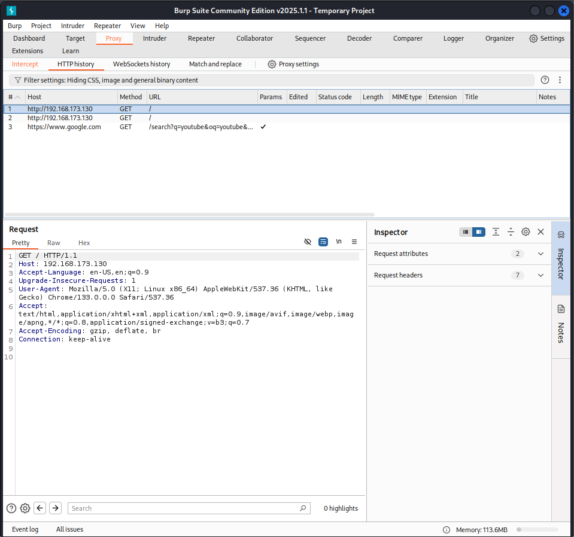

### 🔹3.2 TELNET Brute Force Attack (Hydra)
```bash
hydra -L userlist.txt -P passlist.txt <TARGET_IP> telnet -V
```
- **`-L userlist.txt`**: Path to username list
- **`-P passlist.txt`**: Path to password list
- **`telnet://<TARGET_IP>`**: Target Telnet service
- **`-V`**: Verbose mode (shows attempts)


### 🔹3.3 SSH Brute Force Attack (NetExec)
NetExec (formerly CrackMapExec) is great for SSH:
```bash
nxc ssh <TARGET_IP> -u userlist.txt -p passlist.txt
```
- `-u`: Path to username list
- `-p`: Path to password list
- `-m ssh`: Specifies SSH as the target service

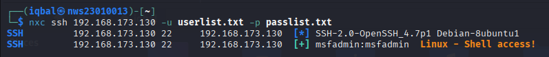

🧠 SSH often has brute force protection — space out requests or use a proxy if needed.

### 🔹3.4 HTTP Login Brute Force Attack (Burp Suite)
1. Launch Burp’s Browser:
    - Go to **Proxy > Intercept** tab.
    - Make sure the **Intercept is ON**.
    - Click **"Open Browser"** — this opens Burp's built-in browser (already configured to route traffic through Burp).
    - Arrange your windows so you can see both Burp and the browser.
2. Intercept a Request
    - In Burp's browser, **navigate to the target login page** (e.g., `http://<target-ip>/login`).
    - Try to **submit the login form** (enter any dummy credentials).
    - Burp will **intercept** the HTTP request.
    - You’ll see the full request in **Proxy > Intercept** tab.
3. Forward the Request
    - Click **"Forward"** to allow the request to continue to the server.
    - If multiple requests are intercepted, keep clicking Forward until the page loads.
    - This is useful if you want to watch exactly how the form is submitted.
4. Turn Off Intercept
    - Go back to the **Proxy > Intercept** tab.
    - Toggle **"Intercept is OFF"** to let future requests pass through automatically.
    - This prevents Burp from pausing the browser every time a request is made.
5. View HTTP History
    - Go to **Proxy > HTTP history**.
    - Scroll to find the **POST request to the login page**.
    - Click it to view the **raw request and response**.
    - Right-click the request → **Send to Intruder**.

4. In **Intruder** tab:
   - Set attack type to **Cluster Bomb**
   - Mark **username** and **password** fields as payload positions
5. Load payloads:
   - Payload set 1: `userlist.txt`
   - Payload set 2: `passlist.txt`
6. Start Attack and watch for:
   - Status code changes
   - Different length in response
   - Success indicators (e.g., “Welcome” or redirect)

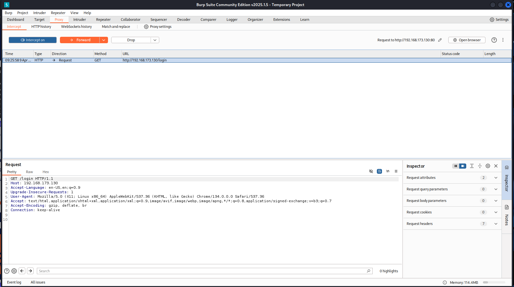
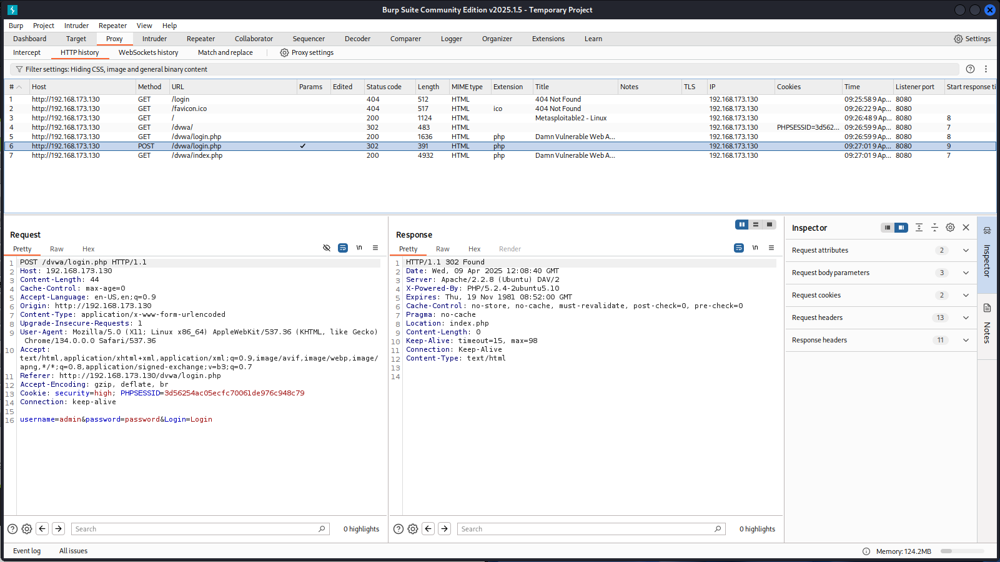
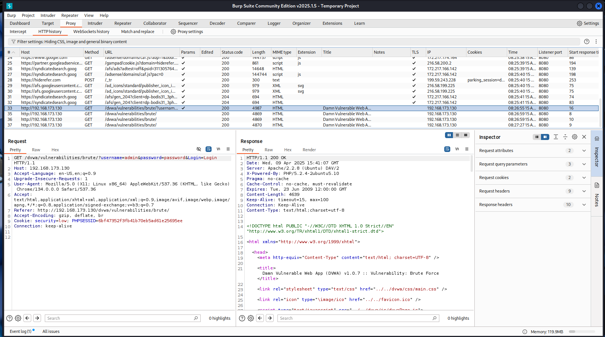

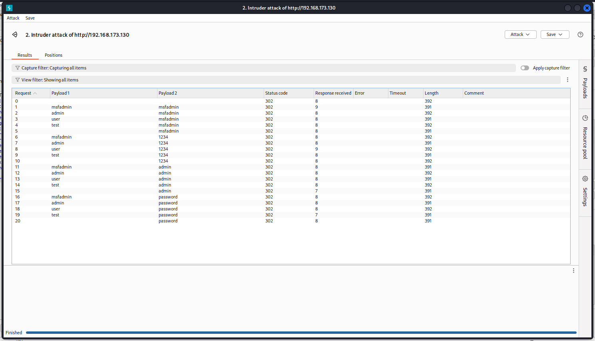

### ⚠️ Common Issues & Fixes

| Problem | Cause | Fix |
|--------|-------|-----|
| Too many failed attempts | Account lockout / rate-limiting | Add delay or reduce threads (`-t 1`) |
| CAPTCHA or login form protections | HTTP brute force fails | May need manual testing or bypass techniques |
| SSH protection (fail2ban) | IP gets banned | Rotate IPs (proxychains or VPN) |

## 🧪 **4. Sniffing Network Traffic**

---

### ✅ **Objective**
Capture and analyze network traffic while logging into FTP, TELNET, SSH, and HTTP services to determine:
- Which protocols **leak credentials in plaintext**
- Which protocols **encrypt** the communication

---

### 🔹 **4.1 Setup Wireshark**
1. Open Wireshark:
```bash
sudo wireshark
```

2. Select the correct interface:
   - Usually `eth0`, `ens33`, or `wlan0` (depending on your setup)

3. Start the capture **before logging into any services**.

---

### 🔹 **4.2 Login with Recovered Credentials**
For each service, use the correct username/password found earlier.

---

#### 🟡 FTP Login
```bash
ftp <TARGET_IP>
```
- Use recovered credentials
- Run a basic command (e.g., `ls`)

🎯 Wireshark filter:
```
tcp.port == 21
```

🧠 Look for:
- USER and PASS commands
- Plaintext username and password in packet contents

---

#### 🟡 TELNET Login
```bash
telnet <TARGET_IP>
```
- Enter username and password manually

🎯 Wireshark filter:
```
tcp.port == 23
```

🧠 Look for:
- Keystrokes being transmitted as plaintext
- Session interaction visible in packets

---

#### 🟢 SSH Login
```bash
ssh <username>@<TARGET_IP>
```

🎯 Wireshark filter:
```
tcp.port == 22
```

🧠 You **won’t** see credentials here. All data (including login) is encrypted. The only thing visible is:
- TCP handshake
- Encrypted payloads

---

#### 🟡 HTTP Login (if there’s a form)
1. Open browser → go to `http://<TARGET_IP>/login`
2. Log in with the known credentials

🎯 Wireshark filter:
```
http
```

🧠 Look for:
- POST request to `/login`
- Username and password inside the payload

🧠 Tip: Right-click → Follow → HTTP Stream to see the full request.

---

### 🛡️ **Result Summary Table**

| Protocol | Encryption | Are credentials visible? | Evidence |
|----------|------------|---------------------------|----------|
| FTP      | ❌ No      | ✅ Yes                    | Screenshot: `USER` & `PASS` packet |
| TELNET   | ❌ No      | ✅ Yes                    | Screenshot: visible keystrokes |
| SSH      | ✅ Yes     | ❌ No                     | Screenshot: encrypted payload |
| HTTP     | ❌ No (if no HTTPS) | ✅ Yes        | Screenshot: POST with creds |


## 5. Problems Encountered
- **Rate Limiting / Account Lockouts:** Some services limit failed attempts.
  - **Solution:** Use slow attack mode (`-t 1` in Hydra) or rotate IPs via proxychains.
- **CAPTCHA / Anti-Brute Force Mechanisms:** Some login forms block automated requests.
  - **Solution:** Modify request headers or use manual testing techniques.

## 6. Mitigation Strategies
| Protocol  | Vulnerability | Secure Alternative |
|-----------|--------------|--------------------|
| FTP       | Plaintext credentials | Use SFTP or FTPS |
| TELNET    | Unencrypted traffic  | Use SSH instead  |
| SSH       | Password brute force | Use SSH keys and 2FA |
| HTTP      | Unsecured login forms | Use HTTPS and implement rate-limiting |

## 7. Conclusion
- Brute force attacks were successfully performed against FTP, TELNET, SSH, and HTTP.
- Unencrypted credentials were captured from FTP and TELNET.
- Mitigation strategies, such as enforcing encryption and key-based authentication, improve security.
